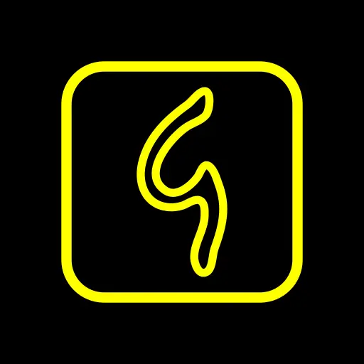

<div align="center">



# 白い熊 GNU Gauguin

**A KenKen-style calculation puzzle, rebuilt in pure black and pure yellow.**

A fork of [Gauguin](https://github.com/meikpiep/gauguin) with **major additions**: a settings page that puts some sixty colour, font, size and border knobs under a live preview, a black-and-yellow house look painted onto every surface of the app, a category backup written as one timestamped ZIP, and a token-gated broadcast contract that lets an automation tool export the app's state without touching the screen.

Installs **side-by-side** with upstream Gauguin (app id `shiroikuma.gauguin`).

**📥 Latest release: [`0.52.1+001`](https://github.com/ShiroiKuma0/shiroikuma-gauguin/releases/latest)** — [all releases & APK downloads »](https://github.com/ShiroiKuma0/shiroikuma-gauguin/releases)

</div>

---

## 🎛 The 白い熊 GNU Gauguin UI page

One page owns the entire look of the app: some sixty knobs over Global, Grid, Keypad, Top panel, Drawer, Dialogs and Lists — every colour, every font, every size, every border thickness and corner radius.

A **live preview is pinned at the top** and redraws on every change: a miniature board with cages, cell lines, a filled number, a cage clue, pencil marks and a selected cell, plus a keypad row and a sample line of text. You see the change before you leave the row.

Colour rows open a picker with A/R/G/B sliders, a live hex readout and one-click swatches prefilled with the colours you have already chosen. Font rows list the built-in families plus every `.ttf`/`.otf` you import — **each row rendered in its own glyphs** — with an import button. Every thickness and radius bottoms out at zero, so a border can go away entirely.

The whole page is generated from one declaration list, which the backup and "reset to defaults" walk as well: a knob is added in exactly one place.

---

## 🟡 Black and yellow, everywhere

Not a theme overlay — the look is painted onto the real views, so it reaches the corners a Material theme cannot.

The **board** draws its cages, cell lines, numbers, clues and pencil marks from the config. The **keypad**, the **top panel**, the **navigation drawer**, the **bottom bar**, the **overflow menu**, every **dialog**, the **settings page** and the **hint flash** follow: black surfaces, `#FFFF00` text and borders — never Material's amber. Tick boxes carry nothing but their own yellow mark; the floating action button is black with a yellow border that follows its own shape.

Upstream's settings tree is re-laid out in the same rows as the fork's own page, so the two read as one: a big bold yellow heading with a word-width underline over each group, tight yellow rows underneath.

---

## 💾 Export / Import

The first section of the UI page. Pick a backup folder — the row stays **red until one is set** — then export any subset of categories as one timestamped ZIP, `shiroikuma-gauguin_<yyyy-MM-dd_HH-mm-ss>.zip`, written atomically through a `.part` file so a half-written backup can never be mistaken for a good one.

Import merges a backup back in key by key, skipping anything it does not recognise, and offers to restart the app so the restored look takes effect at once.

---

## 🤖 The 保存復元 automation contract

Three broadcast actions — `EXPORT_STATE`, `LIST_CATEGORIES`, `CANCEL_EXPORT` — let an automation tool drive a backup with no UI at all.

The gate is a 24-byte token, minted lazily and compared in constant time, with the switch **off by default**. The receiver only gates and hands off: the export itself runs in a foreground service, because a broadcast's window cannot be stretched to cover it. Every request gets **exactly one terminal reply**, guarded against duplicates; progress broadcasts carry real counts and the category id rather than a percentage; a missing storage grant is reported by checking the grant, not by failing.

---

## 📦 Side-by-side, and honest version numbers

The app id is `shiroikuma.gauguin`, so it installs alongside official Gauguin without touching it. Versions read `<upstream version>+<NNN>` — `0.52.1+001` is the first fork build on top of upstream's 0.52.1 — and the upstream base is read straight out of upstream's manifest, so it can never drift from what the fork is actually built on. The counter is zero-padded, so release lists and file managers sort in build order.

The launcher mark is black-and-yellow line art, and the app's name, links and issue tracker point at this fork rather than upstream.

---

## Built on Gauguin

A fork of [Gauguin](https://github.com/meikpiep/gauguin) by Meik Piepmeyer. Gauguin is a polished, ad-free, FOSS take on the KenKen family of calculation puzzles — the grid generation, the human-style solver that rates a grid's difficulty, the statistics and the game itself are all its work, and that is where the credit belongs. This fork only changes how it looks and what it can hand to an automation tool. The code remains under [GPLv3](https://www.gnu.org/licenses/gpl-3.0).

Upstream lives on [F-Droid](https://f-droid.org/packages/org.piepmeyer.gauguin/) and [Google Play](https://play.google.com/store/apps/details?id=org.piepmeyer.gauguin) — if you like the game, that is where to support it.

## Building

```bash
git clone git@github.com:ShiroiKuma0/shiroikuma-gauguin.git
cd shiroikuma-gauguin

# Signed release APK (needs a keystore.properties at the repo root)
JAVA_HOME=/usr/lib/jvm/java-21-openjdk-amd64 ./gradlew :gauguin-app:assembleRelease

# Or the fork build: signed release, copied to ~/tmp, build counter bumped
JAVA_HOME=/usr/lib/jvm/java-21-openjdk-amd64 ./gradlew buildFork
```

JDK 21, Android SDK 37, Gradle 9.7.0, AGP 9.3.1. No native code, so the APK is universal.

## Art & font licences

Carried over from upstream, and unchanged by this fork:

- **Inter** — designed by Rasmus Andersson, under the Open Font License ([homepage](https://rsms.me/inter), [project](https://github.com/rsms/inter)).
- **'The Siesta' by Paul Gauguin** — from the [Metropolitan Museum of Art](https://www.metmuseum.org/art/collection/search/436449), public domain.
- **Signature of Paul Gauguin** — from [WikiMedia](https://commons.wikimedia.org/wiki/File:Gauguin_autograph.png), public domain in many countries, the author having died in 1903.
